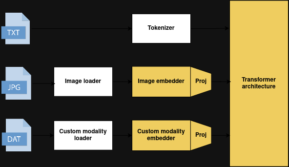

# MultiMeditron

MultiMeditron is a multimodal LLM built by students and researchers from [LiGHT lab](https://www.light-laboratory.org/) 

**Model architecture:**



## Setup

To download the project. Execute the following commands:

```
git clone https://github.com/EPFLiGHT/MultiMeditron.git
cd MultiMeditron
python3 -m venv .venv
source .venv/bin/activate
pip install torch
pip install -e .
```

## Inference

To test a model on some modality, you can run the following script. Here is an example for Llama 3.1 8B and a single image:

```py
import torch
from transformers import AutoTokenizer 
import logging
import os

from multimeditron.dataset.preprocessor import modality_preprocessor
from multimeditron.dataset.registry.fs_registry import FileSystemImageRegistry
from multimeditron.model.model import MultiModalModelForCausalLM 
from multimeditron.dataset.preprocessor.modality_preprocessor import ModalityRetriever, SamplePreprocessor
from multimeditron.model.data_loader import DataCollatorForMultimodal

ATTACHMENT_TOKEN = "<|reserved_special_token_0|>"

# Load tokenizer
tokenizer = AutoTokenizer.from_pretrained("meta-llama/Meta-Llama-3.1-8B-Instruct", dtype=torch.bfloat16)
tokenizer.pad_token = tokenizer.eos_token
special_tokens = {'additional_special_tokens': [ATTACHMENT_TOKEN]}
tokenizer.add_special_tokens(special_tokens)
attachment_token_idx = tokenizer.convert_tokens_to_ids(ATTACHMENT_TOKEN)

model = MultiModalModelForCausalLM.from_pretrained("path/to/trained/model")
model.to("cuda")

modalities = [{"type" : "image", "value" : "path/to/image"}]
conversations = [{
    "role" : "user",
        "content" : f"{ATTACHMENT_TOKEN} Describe the image"
}]
sample = {
    "conversations" : conversations,
    "modalities" : modalities
}

loader = FileSystemImageLoader(base_path=os.getcwd())

collator = DataCollatorForMultimodal(
        tokenizer=tokenizer,
        tokenizer_type="llama",
        modality_processors=model.processors(),
        modality_loaders={"image" : loader},
        attachment_token_idx=attachment_token_idx,
        add_generation_prompt=True
)

batch = collator([sample])

with torch.no_grad():
	outputs = model.generate(batch=batch, temperature=0.1)
 
print(tokenizer.batch_decode(outputs, skip_special_tokens=True, clean_up_tokenization_spaces=True)[0])
```


