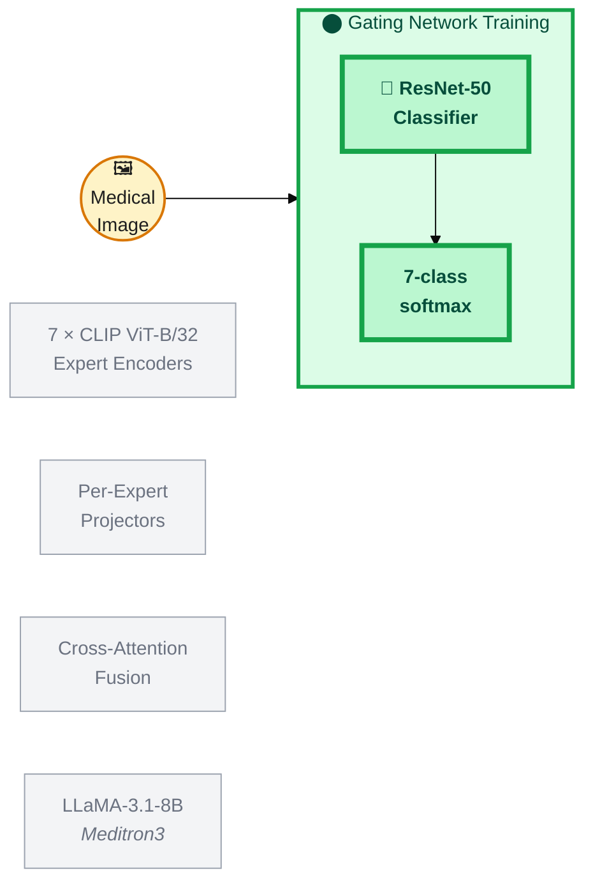
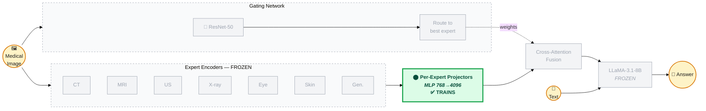
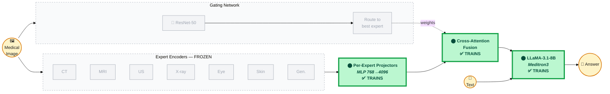

# MultiMeditron Architecture

Paste the code block below into https://mermaid.live to render a PNG/SVG for slides.
Set **Theme → dark** in mermaid.live for best look, or use the light version below.

## Dark-friendly version

```mermaid
%%{init: {'theme': 'dark', 'themeVariables': { 'fontSize': '16px', 'fontFamily': 'Inter, Helvetica, sans-serif' }}}%%

flowchart LR
    IMG(("🖼️<br/>Medical<br/>Image")):::input

    IMG --> GATE
    IMG --> EXP

    subgraph GATE [" "]
        direction TB
        G1["🎯 Gating Network<br/><i>ResNet-50</i>"]:::gate
        G2["Route to<br/>best expert"]:::gate
        G1 --> G2
    end

    subgraph EXP ["Mixture of Experts"]
        direction TB
        E1["🔬 CT"]:::expert
        E2["🧠 MRI"]:::expert
        E3["📡 US"]:::expert
        E4["☢️ X-ray"]:::expert
        E5["👁️ Eye"]:::expert
        E6["🩺 Skin"]:::expert
        E7["🌐 Gen."]:::expert
    end

    EXP --> PROJ["⚙️ Per-Expert<br/>Projectors<br/><i>MLP 768→4096</i>"]:::proj

    G2 -.->|weights| FUSE
    PROJ --> FUSE["🔀 Cross-Attention<br/>Fusion"]:::fuse

    TXT(("💬<br/>Text<br/>Prompt")):::input

    FUSE --> LLM
    TXT --> LLM

    LLM["🧠 LLaMA-3.1-8B<br/><i>Meditron3</i><br/>32 layers · 4096 dim"]:::llm

    LLM --> OUT(("📝<br/>Answer")):::output

    classDef input fill:#1a1a2e,stroke:#e94560,stroke-width:3px,color:#fff
    classDef expert fill:#16213e,stroke:#0f3460,stroke-width:2px,color:#e0e0e0
    classDef gate fill:#1a1a2e,stroke:#e94560,stroke-width:2px,color:#fff
    classDef proj fill:#0f3460,stroke:#53a8b6,stroke-width:2px,color:#fff
    classDef fuse fill:#1b1b2f,stroke:#a855f7,stroke-width:3px,color:#fff
    classDef llm fill:#162447,stroke:#1f4068,stroke-width:3px,color:#fff
    classDef output fill:#1a1a2e,stroke:#e94560,stroke-width:3px,color:#fff

    style EXP fill:#0d1b2a,stroke:#1b98e0,stroke-width:2px,color:#e0e0e0
    style GATE fill:#1a1a2e,stroke:#e94560,stroke-width:2px,stroke-dasharray:5 5,color:#e0e0e0
```



## Light version (white background slides)

```mermaid
%%{init: {'theme': 'base', 'themeVariables': { 'fontSize': '16px', 'fontFamily': 'Inter, Helvetica, sans-serif', 'primaryColor': '#6366f1', 'lineColor': '#94a3b8' }}}%%

flowchart LR
    IMG(("🖼️<br/>Medical<br/>Image")):::input

    IMG --> GATE
    IMG --> EXP

    subgraph GATE [" "]
        direction TB
        G1["🎯 Gating Network<br/><i>ResNet-50</i>"]:::gate
        G2["Route to<br/>best expert"]:::gate
        G1 --> G2
    end

    subgraph EXP ["Mixture of Experts"]
        direction TB
        E1["🔬 CT"]:::expert
        E2["🧠 MRI"]:::expert
        E3["📡 US"]:::expert
        E4["☢️ X-ray"]:::expert
        E5["👁️ Eye"]:::expert
        E6["🩺 Skin"]:::expert
        E7["🌐 Gen."]:::expert
    end

    EXP --> PROJ["⚙️ Per-Expert<br/>Projectors<br/><i>MLP 768→4096</i>"]:::proj

    G2 -.->|weights| FUSE
    PROJ --> FUSE["🔀 Cross-Attention<br/>Fusion"]:::fuse

    TXT(("💬<br/>Text<br/>Prompt")):::input

    FUSE --> LLM
    TXT --> LLM

    LLM["🧠 LLaMA-3.1-8B<br/><i>Meditron3</i><br/>32 layers · 4096 dim"]:::llm

    LLM --> OUT(("📝<br/>Answer")):::output

    classDef input fill:#fef3c7,stroke:#f59e0b,stroke-width:3px,color:#1e1e1e
    classDef expert fill:#ede9fe,stroke:#7c3aed,stroke-width:2px,color:#1e1e1e
    classDef gate fill:#fee2e2,stroke:#ef4444,stroke-width:2px,color:#1e1e1e
    classDef proj fill:#d1fae5,stroke:#10b981,stroke-width:2px,color:#1e1e1e
    classDef fuse fill:#e0e7ff,stroke:#6366f1,stroke-width:3px,color:#1e1e1e
    classDef llm fill:#dbeafe,stroke:#3b82f6,stroke-width:3px,color:#1e1e1e
    classDef output fill:#fef3c7,stroke:#f59e0b,stroke-width:3px,color:#1e1e1e

    style EXP fill:#f5f3ff,stroke:#7c3aed,stroke-width:2px,color:#1e1e1e
    style GATE fill:#fff1f2,stroke:#ef4444,stroke-width:2px,stroke-dasharray:5 5,color:#1e1e1e
```



---

## Training phases — what's trained in each phase

Paste each diagram into https://mermaid.live.
**🟢 Green = trained / updating weights &nbsp;|&nbsp; ⬜ Gray = frozen &nbsp;|&nbsp; 🔵 Blue = not part of this phase**

---

### Phase 0 — Gating Network Training

Only the ResNet-50 gating classifier trains. The expert encoders, projectors, fusion layer and LLM are not involved.



---

### Phase 1 — Stage 1: Alignment Training

**Projectors only** train (map each expert's 768-dim output → 4096-dim LLM space). Everything else is frozen.



---

### Phase 2 — Stage 2: End-to-End Training

**LLM + Projectors** train together. Expert encoders remain fully frozen.



---

### Summary table

| Component | Phase 0 — Gating | Phase 1 — Alignment | Phase 2 — End-to-End |
|-----------|:-----------------:|:-------------------:|:--------------------:|
| **Gating Network (ResNet-50)** | ✅ Trains | ❄️ Frozen | ❄️ Frozen |
| **Expert Encoders (7× CLIP)** | — not involved | ❄️ Frozen | ❄️ Frozen |
| **Per-Expert Projectors (PEP)** | — not involved | ✅ Trains | ✅ Trains |
| **Cross-Attention Fusion** | — not involved | ❄️ Frozen | ✅ Trains |
| **LLM (LLaMA-3.1-8B)** | — not involved | ❄️ Frozen | ✅ Trains |

---

## How to use

1. Go to **https://mermaid.live**
2. Paste the code between the ` ```mermaid ` fences
3. Click **Actions → Download PNG** (or SVG)
4. Insert into Google Slides

## Architecture summary (for slide speaker notes)

| Component | Details |
|-----------|---------|
| **Input** | Medical image (224×224) + text prompt |
| **Expert encoders** | 7 frozen CLIP ViT-B/32 models: CT, Generalist, MRI, Ultrasound, X-ray, Ophthalmology, Dermatology |
| **Gating network** | ResNet-50 trained on 7 modality classes → softmax routing weights |
| **Per-Expert Projectors (PEP)** | 7 independent 3-layer MLPs (768→4096) mapping each expert's output to LLM dimension |
| **Cross-Attention fusion** | Generalist patches = Query; Specialist patches weighted by gating = Key/Value |
| **LLM backbone** | LLaMA-3.1-8B (Meditron3), 32 layers, 32 heads, 4096 hidden dim |
| **Output** | Free-form medical text (diagnosis, description, VQA answer) |

### Training stages

| Stage | What's frozen | What trains | Purpose |
|-------|--------------|-------------|---------|
| **Stage 1** (Alignment) | LLM + all experts | Projectors only | Align vision → language space |
| **Stage 2** (End-to-end) | Experts only | LLM + projectors | Fine-tune language model on medical tasks |
